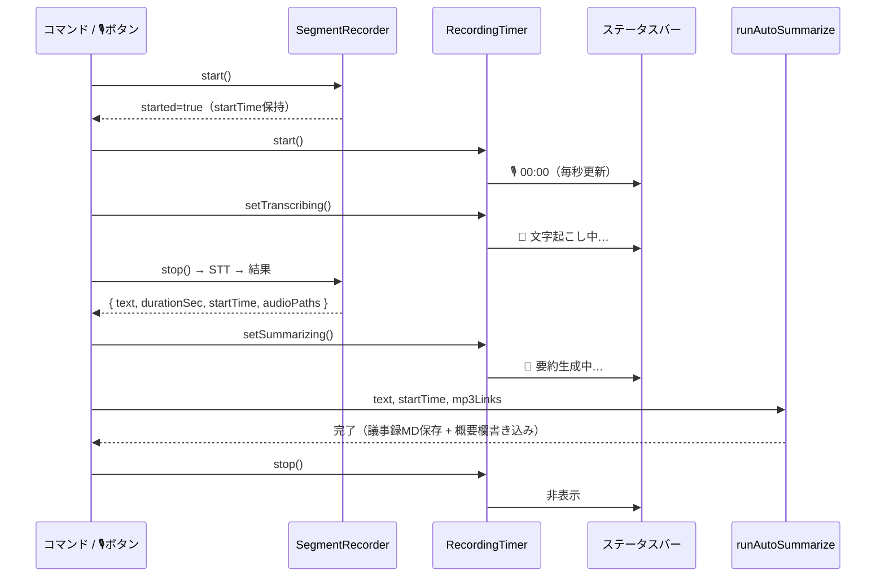

# 🎙️ 録音UI改善（赤点滅・ステータス3段階）+ ファイル命名分離 + MP3埋込 設計

> 📂 パス：`80_POC_Projects/POC_016_GijiObsidian/02_设计文档/07_録音UI改善とファイル命名MP3埋込_設計.md`
> 📍 ソースコード：`D:\AI-Agent\giji-obsidian\obsidian-plugin\`（giji-obsidian プラグイン）
> 📌 状態：設計承認済み（2026-08-09）、実装計画フェーズへ

---

## 🎯 結論（ひと言で）

==録音中は Claudian 🎙️ボタンを赤色点滅させ、ステータスバーに「録音時間 → 文字起こし中 → 要約生成中」を3段階表示。転写MDは `録音＊＊＊＊`、議事録MDは `議事録＊＊＊＊`（＊＊＊=録音開始時刻）に命名し、両MDに録音MP3を `file:///` リンクで埋め込む==

---

## 1️⃣ 要件

| # | 要件 | 現状 | 備考 |
|:--:|------|:--:|------|
| 1 | 録音中 ■ が赤色・点滅 | ❌ CSS未実装 | `giji-recording` クラスは付与済み |
| 2 | ステータスバーに録音→文字起こし→要約生成の状態を表示 | ❌ 録音時間のみ・停止で即非表示 | 3段階フル表示 |
| 3 | 文字起こしMDファイル名：`録音＊＊＊＊` | ❌ `議事録_...` を使用 | ＊＊＊=録音開始時刻（時分まで） |
| 4 | 議事録MDファイル名：`議事録＊＊＊＊` | ⚠️ `fileNameTemplate` が議事録・転写で共用 | ＊＊＊=録音開始時刻（時分まで） |
| 5 | ＊＊＊の時刻は録音の開始時刻 | ❌ `new Date()`（停止時刻）を使用 | 開始時刻を全フローへ伝播 |
| 6 | 文字起こしMDと議事録MDにMP3を組み込む | ❌ 未実装 | `file:///` 外部参照・クリックで再生開始 |
| 7 | 議事録概要欄（開始時間・会議時間・録音ファイル）に録音データを書き込む | ❌ プレースホルダのまま | LLM後処理で確定値を書き込み |

---

## 2️⃣ 確定した前提（ヒアリング結果）

| 項目 | 決定 |
|------|------|
| MP3の置き場所 | Vault外（`C:\Users\<user>\Music\GijiObsidian`）に残す |
| MD内のMP3参照 | `file:///` 絶対パス（Markdownリンク）。`![[...]]` はVault内限定のため不採用 |
| MP3の再生 | MDからクリック → 外部プレイヤーで再生開始 |
| 転写MDの時刻粒度 | 時分まで（`録音_2026年08月09日13時51分`） |
| 議事録MDの時刻粒度 | 時分まで（`議事録_2026年08月09日13時51分`） |
| ステータス表示 | 3段階フル表示（録音中 → 文字起こし中 → 要約生成中 → 非表示） |

---

## 3️⃣ コンポーネント設計

### 3.1 録音UI（CSS + ステータス3段階）

**新規 `src/ui/recordingStyles.ts`**：

```typescript
export function injectRecordingStyles(): void {
  const style = document.createElement("style");
  style.id = "giji-recording-styles";
  style.textContent = `
    .giji-record-btn.giji-recording {
      color: #e33 !important;
      animation: giji-blink 1s ease-in-out infinite;
    }
    @keyframes giji-blink {
      0%, 100% { opacity: 1; }
      50% { opacity: 0.2; }
    }
  `;
  document.head.appendChild(style);
}
```

**`RecordingTimer` を拡張**（`src/ui/recordingTimer.ts`）：

| 状態 | 表示 | メソッド |
|------|------|---------|
| 🎙️ 録音中 | `🎙️ MM:SS`（毎秒更新） | `start()`（既存） |
| 📝 文字起こし中 | `📝 文字起こし中…` | `setTranscribing()`（新規） |
| 🤖 要約生成中 | `🤖 要約生成中…` | `setSummarizing()`（新規） |
| （終了） | 非表示 | `stop()`（既存） |

```typescript
setTranscribing(): void {
  if (this.intervalId !== null) this.deps.clearInterval(this.intervalId);
  this.intervalId = null;
  this.el.setText("📝 文字起こし中…");
  this.el.show();
}

setSummarizing(): void {
  if (this.intervalId !== null) this.deps.clearInterval(this.intervalId);
  this.intervalId = null;
  this.el.setText("🤖 要約生成中…");
  this.el.show();
}
```

### 3.2 ファイル名分離

設定を2つに分離：

| 設定 | 値 | 用途 |
|------|------|------|
| `fileNameTemplate`（既存） | `議事録_{{year}}年{{month}}月{{day}}日{{hour}}時{{minute}}分` | 議事録MD |
| `transcriptFileNameTemplate`（新規） | `録音_{{year}}年{{month}}月{{day}}日{{hour}}時{{minute}}分` | 文字起こしMD |

- `DEFAULT_SETTINGS` に `transcriptFileNameTemplate` を追加
- `settings.ts` 設定タブに「転写ファイル名テンプレート」欄を追加
- `saveTranscriptToFile()` は `transcriptFileNameTemplate` を使用
- `runAutoSummarize()`（cloud/ollama）は `fileNameTemplate` を使用

### 3.3 録音開始時刻の伝播

```typescript
// SegmentResult を拡張
export interface SegmentResult {
  text: string;
  durationSec: number;
  startTime?: Date;        // 🆕 録音開始時刻
  audioPaths?: string[];   // 🆕 MP3埋込用（絶対パス）
}
```

| 場所 | 変更 |
|------|------|
| `SegmentRecorder.start()` | `this.startTime = new Date()` を保持 |
| `SegmentRecorder.stop()` | `SegmentResult` に `startTime`・`audioPaths` を含める |
| `transcribePaths()` | 引数 `TranscribeInput` の `audioPaths` を結果へ引き継ぐ |
| `stopSegment()` | `result.startTime` / `result.audioPaths` を下流へ渡す |
| 🎙️ボタン stop ハンドラ | 同上 |
| `saveTranscriptToFile()` | `now` 引数に `startTime` を渡す |
| `runAutoSummarize()` | 開始時刻・MP3リンクを受け取る |

### 3.4 MP3埋込（外部パス参照）

**新規 `src/notes/mp3Ref.ts`**：

```typescript
/** Windows絶対パス → file:/// URL（スペース等をエンコード） */
export function toFileUrl(absPath: string): string {
  const normalized = absPath.replace(/\\/g, "/");
  const encoded = normalized
    .split("/")
    .map((seg) => encodeURIComponent(seg))
    .join("/");
  return `file:///${encoded}`;
}

/** 録音ファイルのMarkdownリンク（複数セグメント対応） */
export function buildMp3Links(audioPaths: string[]): string {
  if (audioPaths.length === 0) return "";
  return audioPaths
    .map((p, i) => (audioPaths.length > 1 ? `[🎙️ 録音${i + 1}を再生](${toFileUrl(p)})` : `[🎙️ 録音を再生](${toFileUrl(p)})`))
    .join("・");
}
```

**埋め込み箇所**：

| MD | 場所 | 実装 |
|----|------|------|
| 文字起こしMD | 概要表に `🎙️ 録音ファイル` 行を追加 | `renderTranscriptNote()` を拡張（`mp3Links?` 引数） |
| 議事録MD | 概要表の `🎙️ 録音ファイル` セル | `fillMinutesMetadata()` で書き込み |

### 3.5 議事録概要欄への録音データ書き込み

**新規 `src/notes/minutesMetadata.ts`**（純粋関数）：

```typescript
/** 議事録MDの概要表セルに録音データを書き込む（LLM出力の後処理） */
export function fillMinutesMetadata(
  md: string,
  meta: { startTime: Date; durationSec?: number; mp3Links?: string }
): string {
  const start = formatStartTime(meta.startTime);
  const duration = meta.durationSec !== undefined ? formatDuration(meta.durationSec) : "—";
  return md
    .replace(/(\| 🕐 開始時間 \| )([^\n]*)( \|)/, (_a, pre: string, _b: string, post: string) =>
      `${pre}${start}${post}`)
    .replace(/(\| ⏱️ 会議時間 \| )([^\n]*)( \|)/, (_a, pre: string, _b: string, post: string) =>
      `${pre}${duration}${post}`)
    .replace(/(\| 🎙️ 録音ファイル \| )([^\n]*)( \|)/, (_a, pre: string, _b: string, post: string) =>
      `${pre}${meta.mp3Links ?? ""}${post}`);
}

/** 開始時刻を YYYY-MM-DD HH:MM 形式へ */
export function formatStartTime(d: Date): string {
  const p = (n: number) => n.toString().padStart(2, "0");
  return `${d.getFullYear()}-${p(d.getMonth() + 1)}-${p(d.getDate())} ${p(d.getHours())}:${p(d.getMinutes())}`;
}
```

**適用箇所**：
- **cloud/ollama 経路**: `runAutoSummarize()` が LLM 出力 `md` に `fillMinutesMetadata()` を適用してから保存
- **claudian 経路**: プロンプト内に「概要欄に以下を設定」と明示（LLM任せのため後処理は不可）

> ⚠️ **テンプレート差異への対応**：
> - Vault 側テンプレート（`00_Vault管理/議事録テンプレート.md` v1.2.0 以降）は `🎙️ 録音ファイル` 行あり
> - プラグイン同梱 `DEFAULT_MINUTES_TEMPLATE_MD` には `🎙️ 録音ファイル` 行が**無い**
> - `fillMinutesMetadata()` は、`🎙️ 録音ファイル` 行が無い場合は **`| 🎙️ 録音ファイル |  |` 行を `| ⏱️ 会議時間 |...|` の直後に挿入**してから値を書き込む
> - 同梱テンプレートにも `🎙️ 録音ファイル` 行を追加（既定構成として）

---

## 4️⃣ データフロー



---

## 5️⃣ エッジケース対応

| 場面 | 挙動 |
|------|------|
| 録音開始失敗 | `started=false` → `timer.start()` されない（既存ガード） |
| 録音中に再度 record-start | `isRunning` ガードで無視（既存） |
| 録音なしで record-stop | `result === null` → Notice + タイマー非表示 |
| 転写が長い | `setTranscribing()` が表示され続ける |
| 要約が長い | `setSummarizing()` が表示され続ける（cloud/ollama） |
| claudian プロバイダー | プロンプト送信完了で `要約生成中…` を終了（実際の要約は追跡不能） |
| MP3が複数セグメント | `audioPaths` 全件を列挙（`録音1を再生`・`録音2を再生`） |
| パスにスペース | `encodeURIComponent` で `%20` エンコード |
| 議事録MDに概要表が無い | `fillMinutesMetadata` の正規表現が一致しない → 変更なし（安全） |
| 開始時刻が不明（過去データ） | `startTime ?? new Date()` でフォールバック |

---

## 6️⃣ テストと受入

### 自動テスト（新規・更新）

| ファイル | 内容 |
|---------|------|
| `src/__tests__/recordingTimer.test.ts` | `setTranscribing` / `setSummarizing` の表示・interval停止テストを追加 |
| `src/__tests__/mp3Ref.test.ts`（新規） | `toFileUrl`（スペース・日本語）・`buildMp3Links`（単一/複数） |
| `src/__tests__/minutesMetadata.test.ts`（新規） | `fillMinutesMetadata`（開始時間/会議時間/録音ファイル置換・欠落時安全） |
| `src/__tests__/saver.test.ts` | `renderTranscriptNote` の `🎙️ 録音ファイル` 行・`transcriptFileNameTemplate` 使用 |
| `src/__tests__/recorder.test.ts` | `SegmentResult` に `startTime`・`audioPaths` が含まれる |
| `src/__tests__/autoSummarize.test.ts` | `fillMinutesMetadata` 適用後の保存内容 |

既存テストは全てパスし続けること。

### 手動 UAT（主人実機テスト）

| 場面 | 合格基準 |
|------|---------|
| 録音開始（🎙️ボタン） | ボタンが赤色・点滅 |
| 録音開始（コマンド） | ステータスバーに `🎙️ MM:SS` 表示 |
| 録音停止 | ステータスバーに `📝 文字起こし中…` → `🤖 要約生成中…` の順で表示 |
| 全処理完了 | ステータスバーから消える |
| 転写MD生成 | `録音_2026年08月09日13時51分.md`（録音開始時刻） |
| 議事録MD生成 | `議事録_2026年08月09日13時51分.md`（録音開始時刻） |
| 概要欄 | 開始時間・会議時間・録音ファイルが実値で埋まる |
| MP3再生 | MD内リンクをクリック → 外部プレイヤーで再生 |

---

## 📚 参照文献

| # | 種別 | 参照元 |
|:--:|:----:|------|
| 1 | Vault MD | [[06_録音時間ステータスバー表示_設計.md\|録音時間ステータスバー表示設計]] |
| 2 | Vault MD | [[00_Vault管理/議事録テンプレート.md\|議事録テンプレート v1.3.0]] |
| 3 | ソースコード | `D:\AI-Agent\giji-obsidian\obsidian-plugin\src\ui\recordingTimer.ts` |
| 4 | ソースコード | `D:\AI-Agent\giji-obsidian\obsidian-plugin\src\notes\saver.ts` |
| 5 | ソースコード | `D:\AI-Agent\giji-obsidian\obsidian-plugin\src\commands\autoSummarize.ts` |
| 6 | ソースコード | `D:\AI-Agent\giji-obsidian\obsidian-plugin\src\audio\recorder.ts` |
| 7 | Web | https://docs.obsidian.md/Plugins/User+interface/Status+bar |

---

## 📝 更新記録

| バージョン | 日付 | 変更内容 | 変更者 |
|------|------|---------|--------|
| v1.0.0 | 2026-08-09 | 初版（録音UI改善 + ファイル命名分離 + MP3埋込） | MiuMiu 🐾 |

---

*🎙️ 録音UI改善 + ファイル命名分離 + MP3埋込 設計 v1.0.0 · POC_016 GijiObsidian · MiuMiu 🐾 · 2026-08-09*
