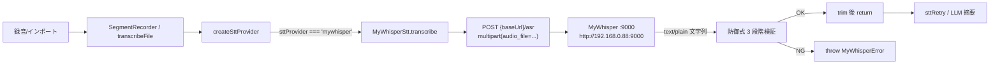

# 設計: GijiObsidian プラグインに MyWhisper 本地 STT Provider を追加

> 📂 パス：`docs/superpowers/specs/2026-08-24-giji-obsidian-mywhisper-design.md`
> 📍 対象：`obsidian-plugin/`（GijiObsidian プラグイン）+ `src/providers/stt.ts`
> 🗓️ 作成日：2026-08-24
> 📊 状態：✅ ユーザー承認済み（brainstorming §1〜§4 通過）

---

## 1. 機能概要

GijiObsidian プラグインの STT Provider 一覧に **「MyWhisper 本地 (POC_020)」** を追加する。
MyWhisper は主人 LAN 上で稼働する自研 ASR サーバ（`http://192.168.0.88:9000/`）で、
OpenAI Whisper API 互換ではなく独自のエンドポイント契約を持つため、既存 5 つの
Provider クラスを流用せず独立クラスとして実装する。

| 項目 | 内容 |
|------|------|
| 設置場所 | 設定画面 → 📝 転写タブ → STT Provider ドロップダウンに `mywhisper` 追加 |
| 入力 | 録音 / インポート音声（WAV / MP3 / M4A / FLAC / OGG） |
| 処理 | `POST {baseUrl}/asr`（multipart, field=`audio_file`） → raw text 取得 |
| 出力 | 文字列を既存 STT 契約どおり返却 → LLM 摘要へ |
| 既定 Base URL | `http://192.168.0.88:9000/` |
| 認証 | :9000 は無認証。Bearer Token 設定欄のみ预留（未来拡張） |

### MyWhisper API 契約（参照: [[../../../../80_POC_Projects/POC_020_MyWhisper/02_設計文書/05_API設計.md|POC_020 API設計 §3.2]]）

| 項目 | 値 |
|------|------|
| Endpoint | `POST {baseUrl}/asr` |
| Content-Type | `multipart/form-data` |
| 必須フィールド | `audio_file`（file, 最大 1 GB） |
| 任意フィールド | `language`（ISO 639-1: `ja` / `zh` / `en` / `auto`）, `task`（`transcribe` / `translate`）, `output`（`txt` / `srt`） |
| 応答 | **HTTP 200 + `text/plain` 文字列本体**（JSON 包装なし） |
| 認証 | :9000 は無認証 |

---

## 2. コンポーネント構成

| 種別 | ファイル | 内容 |
|------|---------|------|
| ➕ 新規 | `obsidian-plugin/src/__tests__/mywhisperStt.test.ts` | 14 件のユニットテスト |
| ✏️ 変更 | `obsidian-plugin/src/providers/stt.ts` | `MyWhisperStt` クラス + `MyWhisperError` クラス + factory 分岐 |
| ✏️ 変更 | `obsidian-plugin/src/providers/sttProfiles.ts` | profile バックアップキー集合に 2 キー追加 |
| ✏️ 変更 | `obsidian-plugin/src/settings.ts` | `GijiSettings` に 2 フィールド追加 + DEFAULT 値 + SettingsTab 条件 UI |
| ✏️ 変更 | `obsidian-plugin/src/main.ts` | `STT_PROVIDERS` 配列 + `STT_PROVIDER_LABELS` に `mywhisper` 追加 |
| ✏️ 変更 | `obsidian-plugin/manifest.json` | version `0.6.0` → `0.7.0` |
| ✏️ 変更 | `obsidian-plugin/CHANGELOG.md` | `## [0.7.0]` エントリ追加 |
| ✏️ 変更 | `obsidian-plugin/README.md` | 対応 STT エンジン表に行追加 |
| ✏️ 変更 | `obsidian-plugin/08_説明書/02_ユーザーマニュアル/機能詳細.md` | 「MyWhisper 本地」節追加 |
| 🔁 再利用 | `nodeFetch` / `transcribeWithRetry` / `createSttProvider` | 変更なし |

### 2-1. 新規クラス `src/providers/stt.ts` 末尾

```typescript
/** MyWhisper エラー（HTTP status + body を保持して上層リトライ判断に使用） */
export class MyWhisperError extends Error {
  constructor(
    message: string,
    public readonly status?: number,
    public readonly body?: string,
  ) {
    super(message);
    this.name = "MyWhisperError";
  }
}

/** MyWhisper 本地 STT Provider（POC_020 ASR サーバ専用） */
export class MyWhisperStt implements SttProvider {
  readonly id = "mywhisper";
  readonly maxChunkSec?: number = undefined;
  readonly maxBytesPerRequest?: number = 1_073_741_824; // 1 GB

  constructor(
    private readonly baseUrl: string,
    private readonly token?: string,
    private readonly fetchImpl: typeof fetch = nodeFetch,
  ) {}

  async transcribe(audio: ArrayBuffer, lang: SttLang): Promise<string>;
}
```

---

## 3. データフロー



### 3-1. `transcribe()` 実装ステップ

1. **URL 整形**: `baseUrl.replace(/\/+$/, "") + "/asr"`
2. **FormData 構築**:
   - `audio_file`: `new Blob([audio], { type: "audio/wav" })`, filename `"audio.wav"`
   - `language`: `lang !== "auto"` のときのみ付与（`zh` / `ja` / `en` 透伝）
   - `task` / `output`: 付与しない（デフォルト `transcribe` / `txt`）
3. **ヘッダ**: `token` 非空時のみ `Authorization: Bearer {token}` を付与。`Content-Type` は fetch + FormData 自動付与に任せる
4. **fetch**: `POST {url}`, body=FormData
5. **防御式検証**（次節 §4）
6. **return** `body.trim()`

---

## 4. エラーハンドリング（防御式 3 段階）

### 4-1. 段階 1: Content-Type 検証

```typescript
const ct = response.headers.get("content-type") ?? "";
if (!ct.startsWith("text/")) {
  throw new MyWhisperError(
    `MyWhisper 返回非文本响应 (${ct})`,
    response.status,
    (await response.text()).slice(0, 500),
  );
}
```

目的: `application/json` 形式のエラーボディや、`text/html` 以外の異常型を即座に弾く。

### 4-2. HTTP エラー応答

```typescript
if (!response.ok) {
  throw new MyWhisperError(
    `MyWhisper 错误 ${response.status}: ${body.slice(0, 200)}`,
    response.status,
    body,
  );
}
```

対象: 422（フォーム校验失败）/ 413（文件过大）/ 5xx（サーバ異常）など。`status` を保持して上層 retry 判断に委ねる。

### 4-3. 段階 2: HTML エラーページ検出（誤検知回避）

```typescript
const trimmedStart = body.trimStart();
if (trimmedStart.startsWith("<")) {
  const looksLikeError =
    /<\/?(html|title|h1)|HTTP\/.*\s(5\d\d|4\d\d)|Bad Gateway|Service Unavailable/i
      .test(body.slice(0, 500));
  if (looksLikeError) {
    throw new MyWhisperError(
      `MyWhisper 返回 HTML 错误页（可能服务未启动或反代拦截）`,
      response.status,
      body.slice(0, 500),
    );
  }
}
```

目的: 502 Bad Gateway / nginx 503 / Cloudflare エラーページが text/html で返ってきた場合を検出。
`startsWith("<")` だけでは誤検知（XML 字幕など）するため、正規表現で「明らかに HTML エラー」と判定できる場合のみ throw。

### 4-4. 段階 3: 空テキスト検出

```typescript
const result = body.trim();
if (!result) {
  throw new MyWhisperError(
    "MyWhisper 返回空文本（音频可能无语音或静音过长）",
  );
}
return result;
```

目的: 録音失敗 / 全区間無音 / モデル未ロード で空文字列が返るケースを可視化。

### 4-5. `sttRetry.ts` との協調

- `error instanceof MyWhisperError && [502, 503, 504].includes(error.status)` → **リトライ跳过**（サービス落ちは再試行無意味）
- `MyWhisperError(status=429)` → 既存 429 リトライロジックで 1 回再試行
- その他の `MyWhisperError` → リトライ跳过（422 / 413 / HTML エラーは再試行しても改善しない）
- `fetch` 自体のネットワークエラー → 既存挙動（リトライ判定）に委ねる

---

## 5. Settings Schema

### 5-1. 新規フィールド

```typescript
export interface GijiSettings {
  // ... 既存 30+ フィールド ...

  /** MyWhisper ASR サーバ Base URL */
  sttMyWhisperBaseUrl: string;
  /** MyWhisper 用 Bearer Token（:9000 は無認証のため通常空） */
  sttMyWhisperToken: string;
}
```

### 5-2. DEFAULT_SETTINGS 追加

```typescript
sttMyWhisperBaseUrl: "http://192.168.0.88:9000/",
sttMyWhisperToken: "",
```

### 5-3. SettingsTab UI（📝 転写タブ内）

STT Provider ドロップダウンの直下に **条件渲染** セクションを追加。
`mywhisper` 選択時のみ表示（`settingEl.style.display` 切替）。

| フィールド | Placeholder | バリデーション |
|-----------|-------------|---------------|
| `Base URL` | `http://192.168.0.88:9000/` | `^https?://` で始まる |
| `Token (可选)` | `留空表示無認証` | 任意文字列 |

```
┌─ 语音转写引擎 ──────────────────────────┐
│ Provider: [MyWhisper 本地 (POC_020)  ▾] │
│                                         │
│ ┌─ MyWhisper 配置(本地 ASR 服务) ──┐ │
│ │ Base URL:                          │ │
│ │ ┌────────────────────────────────┐ │ │
│ │ │ http://192.168.0.88:9000/      │ │ │
│ │ └────────────────────────────────┘ │ │
│ │ Token (可选):                      │ │
│ │ ┌────────────────────────────────┐ │ │
│ │ │                                │ │ │
│ │ └────────────────────────────────┘ │ │
│ │ 💡 默认指向主人 LAN 部署实例        │ │
│ │    修改为其他地址后可保存           │ │
│ └─────────────────────────────────────┘ │
└─────────────────────────────────────────┘
```

### 5-4. STT_PROVIDERS 配列（`main.ts`）

```typescript
export const STT_PROVIDERS = [
  "openai", "google", "groq", "qwen3-asr", "whisper-small", "mywhisper",
] as const;

export const STT_PROVIDER_LABELS: Record<SttProviderId, string> = {
  openai: "OpenAI Whisper API",
  google: "Google Speech-to-Text",
  groq: "Groq Whisper (whisper-large-v3-turbo)",
  "qwen3-asr": "Qwen3-ASR 本地 (Bundled)",
  "whisper-small": "Whisper Small 本地 (Bundled)",
  mywhisper: "MyWhisper 本地 (POC_020)",
};
```

### 5-5. Provider ファクトリ分岐（`stt.ts`）

```typescript
case "mywhisper":
  return new MyWhisperStt(
    settings.sttMyWhisperBaseUrl.replace(/\/+$/, ""),
    settings.sttMyWhisperToken || undefined,
  );
```

### 5-6. Profile 機構（`sttProfiles.ts`）

```typescript
const STT_PROFILE_BACKUP_KEYS = new Set([
  "sttApiKey", "sttBaseUrl", "sttModel",
  "sttMyWhisperBaseUrl", "sttMyWhisperToken", // ← 新增
]);
```

効果: `mywhisper` → `openai` → `mywhisper` と切り替えても、Base URL と Token は保持される。

---

## 6. テスト戦略

### 6-1. ユニットテスト `src/__tests__/mywhisperStt.test.ts`

`node:test` + tsx、既存テストスタックと同一。`fetch` は注入モック化（実 HTTP 送信なし）。

| # | ケース名 | 入力 | 期待結果 |
|:--:|---------|------|---------|
| 1 | 正常転写（ja） | `lang="ja"`, fetch 200 + `text/plain`「こんにちは」 | `return "こんにちは"` |
| 2 | language 透伝（zh） | `lang="zh"` | FormData に `language="zh"` |
| 3 | language=auto 省略 | `lang="auto"` | FormData に `language` 無し |
| 4 | Bearer Token 注入 | `token="abc123"` | request header に `Authorization: Bearer abc123` |
| 5 | 空 token 注入無し | `token=""` または `undefined` | header に `Authorization` 無し |
| 6 | 422 表単校验 | fetch 422 + body「missing audio_file」 | `throw MyWhisperError`, status=422 |
| 7 | 413 过大 | fetch 413 + body「too large」 | `throw`, status=413 |
| 8 | HTML エラーページ検出 | fetch 200 + `text/html` + `<html>502 Bad Gateway</html>` | `throw`, message「返回 HTML 错误页」 |
| 9 | 非テキスト content-type | fetch 200 + `application/json` + `{}` | `throw`, content-type 情報含有 |
| 10 | 空応答検出 | fetch 200 + `text/plain` + `""` | `throw「返回空文本」` |
| 11 | 前後空白 trim | fetch 200 + `"  你好  \n"` | `return "你好"` |
| 12 | フィールド名硬约束 | 全ケース | FormData の field 名 = `audio_file` |
| 13 | URL 去尾斜杠 | `baseUrl="http://x:9000////"` | 送信 URL = `http://x:9000/asr` |
| 14 | 502/503/504 リトライ跳过 | `transcribeWithRetry` 内統合テスト | retry カウンタが増えない |

### 6-2. 手動 E2E（受入テスト）

| # | シナリオ | 確認内容 |
|:--:|---------|---------|
| E1 | 正常フロー | 設定で MyWhisper 選択 → Base URL 既定のまま → 5 秒中国語録音 → 転写成功 |
| E2 | URL 間違え | Base URL を `http://192.168.0.88:9001/` に変更 → エラーメッセージが明確 |
| E3 | サーバ停止 | MyWhisper 停止 → 録音試行 → 「返回 HTML 错误页」または「接続失敗」 |
| E4 | Profile 切替 | mywhisper → openai → mywhisper、Base URL が保持されている |
| E5 | Token 注入 | 空 token で録音成功 → 仮に MyWhisper 側で auth 有効化しても予備欄で設定可能 |

---

## 7. データ移行・後方互換

- ✅ **完全後方互換**: `DEFAULT_SETTINGS` 増分マージのみ。既存ユーザの `data.json` に新フィールドが無い場合、Obsidian プラグイン起動時に自動補完される
- ✅ **既存ユーザへの影響なし**: 本 PR では `data.json` の現 `sttProvider` 値を能動的に変更しない。MyWhisper を選択するには手動操作が必要
- ❌ **ワンショット migration スクリプト不要**: 破壊的スキーマ変更なし

---

## 8. ロールバック

1. `git revert HEAD` で全変更を巻き戻し（5 ファイル + 1 新規テストファイル）
2. 既存 Provider には一切影響しない（独立クラス・独立フィールド・独立 UI 区間）
3. 最悪ケース: ユーザは設定画面で Provider を元の `openai` 等に戻せば即復帰

---

## 9. スコープ外（明示的にやらないこと）

| 項目 | 理由 |
|------|------|
| MyWhisper 自動起動 | MyWhisper は独立プロジェクト + 自前 Dashboard (:9001) でライフサイクル管理。プラグインからの二重起動は避ける |
| :9001 Dashboard 統合 | 本タスクは「僅新增 STT provider」の最小スコープ。将来別 PR で対応 |
| AI 校正 `/correct` 統合 | 同上、LLM 校正系は別タスク |
| 設定画面に「接続テスト」ボタン | 最小スコープ外。エラー検出は transcribe 時の防御式検証で担保 |
| OpenAI 互換 wrapper | MyWhisper 端点契約は安定。抽象層は YAGNI |

---

## 10. 想定影響

| 影響範囲 | 程度 |
|---------|------|
| 既存コード | 4 ファイル変更、合計 +120 行（+90 実装 +25 settings +2 main.ts +2 profiles +1 manifest） |
| 既存テスト | 影響なし（既存 40+ テストは green 維持） |
| 新規テスト | +130 行 / 14 ケース |
| ドキュメント | 4 ファイル更新（README / CHANGELOG / 機能詳細 / 本 spec） |
| プラグインサイズ | main.js への影響は +1〜2 KB 程度（クラス + UI） |
| Vault 既存ユーザ | 影響なし（設定で選択しない限り MyWhisper は呼ばれない） |

---

## 11. 変更ファイル一覧

```
M obsidian-plugin/manifest.json                                    +1
M obsidian-plugin/CHANGELOG.md                                     +5
M obsidian-plugin/README.md                                        +2
M obsidian-plugin/08_説明書/02_ユーザーマニュアル/機能詳細.md       +20
M obsidian-plugin/src/providers/stt.ts                             +90
M obsidian-plugin/src/providers/sttProfiles.ts                     +2
M obsidian-plugin/src/settings.ts                                  +25
M obsidian-plugin/src/main.ts                                      +2
A obsidian-plugin/src/__tests__/mywhisperStt.test.ts               +130
A docs/superpowers/specs/2026-08-24-giji-obsidian-mywhisper-design.md
```

合計: 7 変更 + 2 新規 ≒ +280 行（実装）+ 130 行（テスト）

---

## 12. 参照リンク

- 📄 [[../../../../80_POC_Projects/POC_020_MyWhisper/02_設計文書/05_API設計.md|POC_020 API 設計書 §3.2]]
- 📄 [[../../../../80_POC_Projects/POC_020_MyWhisper/README.md|MyWhisper README]]
- 📄 `obsidian-plugin/src/providers/stt.ts`（既存 5 Provider 実装リファレンス）
- 📄 `obsidian-plugin/src/providers/sttProfiles.ts`（profile 機構）
- 📄 `obsidian-plugin/src/providers/nodeFetch.ts`（fetch 注入先）
- 📄 `obsidian-plugin/src/providers/sttRetry.ts`（リトライ判定拡張ポイント）
- 📄 `obsidian-plugin/src/__tests__/qwen3AsrStt.test.ts`（既存テストパターンリファレンス）

---

*📚 Design v0.1 · GijiObsidian + MyWhisper 統合 · brainstorming 2026-08-24*
