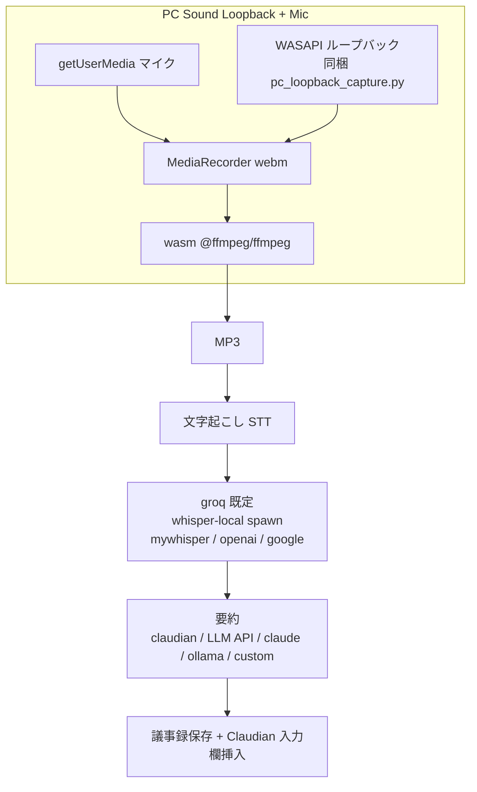

# GijiObsidian 単体使用化（外部参照なし）設計書

> 📂 パス：`docs/superpowers/specs/2026-08-31-giji-obsidian-standalone-design.md`
> 📍 対象：`D:\AI-Agent\GijiObsidian\obsidian-plugin`
> 日付：2026-08-31

---

## 1. 背景（問題）

### 1.1 発端

主人からの確認依頼：

> GijiObsidian のモジュール依存関係を確認。Plugin 以外を参照していないか。
> プラグインフォルダをコピーするだけで、どこでも使用できるようにしてほしい。
> `D:\AI-Agent\GijiObsidian` や別途 ffmpeg インストールは不要にしたい。

### 1.2 監査で判明した外部依存

プラグイン本番ソース（test 除外）の外部 import は以下のみで、Obsidian Plugin API 以外への参照が存在した：

| import | 件数 | 種別 | 単体使用への影響 |
|:--:|:--:|:--:|:--:|
| `obsidian` | 16 | Plugin API | ✅ 本命 |
| `path` / `fs` / `fs/promises` | 6 / 5+1 / 1 | Node built-in | ✅ Obsidian 既定 |
| `os` | 2 | Node built-in | ✅ Obsidian 既定 |
| `child_process` | 3 | Node built-in | ✅ Obsidian 既定 |
| `@ffmpeg/ffmpeg` | 1 | 外部 npm | ✅ 同梱（wasm） |
| `electron`（`require`） | 2 | 実行時 require | ✅ Obsidian 同梱 |

### 1.3 単体使用を阻害する真の障害

`D:\AI-Agent\GijiObsidian` への**ハードコード絶対パス**と、**外部 Python サービスへの依存**が本丸：

| # | 依存 | 箇所 | 単体使用への影響 |
|:--:|------|------|------|
| 1 | **recorder-bridge**（Python サービス） | `settings.ts:186` `bridgeDir`、`bridgeLauncher.ts` | ブリッジ録音の要。**外部 Python を spawn** |
| 2 | **whisper-local-server**（Python/faster-whisper） | `settings.ts:159` `sttServerDir` | ローカル文字起こしの要。**外部 Python を spawn** |
| 3 | **システム ffmpeg CLI** | `directRecorder.ts:74-77` `defaultFfmpeg` | MP3 変換。**別途 ffmpeg インストール必須** |
| 4 | PC 音声（WASAPI）キャプチャ | `directRecorder.ts:86-137` | `bridgeDir/pc_loopback_capture.py` を参照（→ `pcLoopbackScriptDir` へ移す） |

`@ffmpeg/ffmpeg`（wasm）は esbuild でバンドルされ、`ffmpeg-core.js/wasm` はビルド時にプラグインフォルダへコピーされるため**既に自己完結**。

### 1.4 Obsidian の制約（getDisplayMedia は無効）

> ⚠️ 重大：`2026-08-28-giji-obsidian-remove-bridge-direct-only-design.md` §1.2 に確認済み。
> Obsidian（Electron）は `session.setDisplayMediaRequestHandler` を実装しておらず、`getDisplayMedia()` は必ず `NotSupportedError` で失敗する。

このため、**PC 音声（TEAMS ミーティング音含む）を取るには WASAPI ループバック（Python スクリプト）が唯一の手段**。getDisplayMedia はフォールバックにもならない。

---

## 2. ゴール

プラグインフォルダをコピーするだけで、任意の Vault で**録音 → 文字起こし → 要約**が動作する。

- 外部 Python サービス（recorder-bridge）への依存を**完全削除**。
- `D:\AI-Agent\GijiObsidian` の**ハードコード絶対パスを全廃**。
- 別途 ffmpeg インストールを**不要化**（wasm に統一）。
- TEAMS ミーティング等の PC 音声を**WASAPI ループバック**でキャプチャ（同梱スクリプト）。
- 文字起こしはクラウド（groq）を既定とし、whisper-local（spawn・モデルフォルダ参照）/ mywhisper / cloud を選択可。

---

## 3. 要件（ユーザー決定事項）

| # | 項目 | 決定 |
|---|---|---|
| 1 | ブリッジ録音 | **完全削除**（ダイレクトのみ） |
| 2 | ダイレクト録音 | マイク＋PC 音声、Bluetooth イヤホン対応（デバイス選択） |
| 3 | TEAMS ミーティング録音 | **PC 音声ループバック**（WASAPI）でキャプチャ |
| 4 | 文字起こし（STT）既定 | **クラウドSTT（groq）** |
| 5 | whisper-local | **spawn 復活**＋外部モデルフォルダ参照（`sttWhisperModelDir`） |
| 6 | ffmpeg | **wasm に統一**（システム CLI 廃止） |
| 7 | Claude CLI | **追加しない**（既存 claudian/LLM API/claude/ollama/custom） |
| 8 | PC 音声キャプチャ手段 | **WASAPI ループバック同梱スクリプトが主**（getDisplayMedia は使わない） |
| 9 | WASAPI 同梱の依存 | **汎用 python/py 実行**（依存はユーザー環境に pip 導入） |
| 10 | recorder-bridge / whisper-local-server | ディスク上は**残す**（削除しない） |

---

## 4. 変更内容

### 4.1 削除ファイル

| ファイル | 内容 |
|---|---|
| `src/bridge.ts` | `bridgeHealth` / `bridgeListDevices` / `bridgeStart` / `bridgeStop` |
| `src/bridgeLauncher.ts` | `isBridgeUp` / `launchBridge` |
| `src/__tests__/bridgeLauncher.test.ts` | 上記のテスト |

### 4.2 `src/settings.ts`

**型**
- `RecordingMethodId` を削除。
- `GijiSettings` から削除：
  - `recordingMethod`
  - `bridgeBaseUrl` / `bridgeDir`
  - `bridgeMicDeviceId` / `bridgeSpeakerDeviceId`

**`DEFAULT_SETTINGS`（設定変更）**

| 項目 | 現状 | 変更後 |
|------|------|--------|
| `sttProvider` | `whisper-local` | **`groq`** |
| `sttServerDir` | `D:\AI-Agent\...\whisper-local-server` | `""`（ユーザー設定） |
| `sttWhisperModelDir` | `""` | `""`（main.ts で `manifest.dir/Model` を既定解決、ユーザーが外部フォルダ参照可能） |
| `sttMyWhisperBaseUrl` | `http://192.168.0.88:9000/` | `""` |
| `bridgeBaseUrl` | `http://127.0.0.1:17890` | （削除） |
| `bridgeDir` | `D:\AI-Agent\...\recorder-bridge` | （削除） |
| `recordingMethod` | `direct` | （削除） |
| `bridgeMicDeviceId` / `bridgeSpeakerDeviceId` | `""` | （削除） |
| `directSpeakerDeviceId` | `""` | 保持（WASAPI ループバックデバイス選択） |
| `pcLoopbackScriptDir`（新規） | — | `""`（同梱スクリプトのパス。空なら同梱既定） |

**関数**
- `isBridgeSettingDisabled()` を削除。

**設定 UI**
- 「🎙️ 録音手法」ドロップダウンを撤去（常にダイレクト）。
- 「🔗 ブリッジ URL」「ブリッジのディレクトリ」欄を撤去。
- 録音モード（audioSource）は **MIX / MIC / スピーカー** を維持（`mix` / `mic` / `pcLoopback` の値は不変）。
- `directSpeakerDeviceId` はスピーカー/ループバックデバイス選択として維持。

### 4.3 `src/audio/recorder.ts`

- import から `bridgeHealth` / `bridgeStart` / `bridgeStop` を削除。
- `SegmentRecorder.sessionId` フィールドを削除。
- `start()`：bridge 分岐を削除し、常に `this.direct.start(settings)`。
- `stop()`：bridge セッション処理を削除し、常に `this.direct.stop(settings)` → `transcribePaths()`。
- `transcribePaths()`：whisper-local は `ensureWhisperLocalServer`（spawn 復活版）を使用。

### 4.4 `src/audio/directRecorder.ts`

- `defaultFfmpeg`（`execFile("ffmpeg")`）→ **wasm `@ffmpeg/ffmpeg`** に置換。
  - DI（`deps.ffmpeg`）は維持し、テスト用モックを可能に。
- PC 音声キャプチャ：
  - getDisplayMedia 経路を**削除**（Obsidian では無効のため）。
  - `spawnPcLoopbackCapture` のスクリプト参照を `bridgeDir` → **`pcLoopbackScriptDir`**（空なら同梱既定 `manifest.dir/pc_loopback_capture.py`）に変更。
- マイク（getUserMedia）+ WASAPI ループバックのミックスで録音。Bluetooth イヤホンはデバイス選択で対応。
- audioSource の動作：
  - `mic` → getUserMedia のみ。
  - `pcLoopback` → WASAPI ループバックのみ。
  - `mix` → getUserMedia + WASAPI ループバックのミックス（Web Audio `MediaStreamAudioDestinationNode` 経由、既存 `mixStreams` を再利用）。

### 4.5 `src/whisperLocalLauncher.ts`

- spawn を**復活**（`sttServerDir` は設定値、`D:\AI-Agent` 直書きなし）。
- モデル（`whisper-{model}`）ファイルの保存先を `sttWhisperModelDir`（外部フォルダ参照可能）から解決。
- `isWhisperLocalUp` / health check は維持。

### 4.6 `src/audio/ffmpegConvert.ts`

- wasm `@ffmpeg/ffmpeg` を録音後の MP3 変換（directRecorder）と共通利用に揃える。

### 4.7 `src/ui/claudianButton.ts`

- import `isBridgeUp` / `launchBridge` を削除。
- `shouldShowBridgeButton()` / `makeBridgeButton()` / `refreshBridgeButtons()` / `updateBridgeButton()` を削除。
- ツールバー構築からブリッジボタン挿入・状態更新を削除。

### 4.8 `src/main.ts`

- `recordingMethod` マイグレーションを削除。
- `loadSettings()`：`sttWhisperModelDir` 既定を `manifest.dir/Model` に解決（未設定時）。
- `setupClaudianButton` は維持。

### 4.9 `package.json` / 同梱

- 未使用 `@ffmpeg/core` / `@ffmpeg/util` を整理（wasm 実体は同梱継続）。
- `pc_loopback_capture.py` をプラグインフォルダへ**同梱**（実行は汎用 python/py、依存 `soundcard` 等はユーザー環境に pip 導入）。

### 4.10 テスト

| ファイル | 対応 |
|---|---|
| `src/__tests__/bridgeLauncher.test.ts` | **削除** |
| `src/__tests__/recorder.test.ts` | bridge / `recordingMethod` 分岐テストを削除 |
| `src/__tests__/settings.test.ts` | `DEFAULT_SETTINGS` の sttProvider=groq / sttServerDir="" / bridge 削除 を反映 |
| `src/__tests__/claudianButton.test.ts` | ブリッジボタンテストを削除 |
| `src/__tests__/directRecorder.test.ts` | ffmpeg wasm 化・pcLoopbackScriptDir 参照を反映 |
| `src/__tests__/whisperLocalLauncher.test.ts` | spawn 復活・モデルフォルダ参照を反映 |

### 4.11 バージョン・ビルド・デプロイ

- `package.json` / `manifest.json`：`0.11.0` → **`0.12.0`**
- `CHANGELOG.md` に v0.12.0 エントリ追記。
- `npm run build` → `main.js` / `manifest.json` を Vault へデプロイ。

---

## 5. データフロー（変更後）

---

## 6. エラーハンドリング

- WASAPI ループバック起動失敗 → マイクのみで録音（警告 `Notice`）。
- 同梱 `pc_loopback_capture.py` が import 依存（`soundcard`）を解決できない → 明確なエラーで「pip install soundcard」を案内。
- クラウドSTT（groq）API キー未設定 → 設定タブへ誘導。
- whisper-local：`sttServerDir` 未設定 / `sttBaseUrl` 未設定 / 接続不可 → 明確なエラー。
- wasm ffmpeg ロード失敗 → 明示エラー。

---

## 7. テスト戦略

- 既存テストから bridge 参照を除去し、**全テスト PASS** を確認：`cd obsidian-plugin && npm test`。
- TDD で ffmpeg wasm 化・pcLoopbackScriptDir・whisper-local spawn を追加テスト。
- 手動 UAT（主人）：
  1. プラグインフォルダだけを別 Vault にコピーして使えること。
  2. TEAMS ミーティング中に PC 音声ループバックで録音できること。
  3. クラウド STT（groq 既定）で文字起こしできること。
  4. whisper-local は外部モデルフォルダ参照でローカル文字起こしできること。
  5. 要約（claudian / LLM API）が動作すること。

---

## 8. スコープ外（今回はやらない）

- Claude CLI（`claude` コマンド spawn）プロバイダの追加。
- `recorder-bridge` / `whisper-local-server`（Python）の削除・改修。
- WASAPI 同梱スクリプトの venv 同梱。
- Obsidian の internal API（`app.vault.adapter as any` 等）の公開 API 置き換え（本設計のスコープ外）。※既知のリスクとして残置。

---

## 9. 参照文献

| # | 種別 | 参照元 |
|:--:|:----:|------|
| 1 | Vault MD | `docs/superpowers/specs/2026-08-28-giji-obsidian-remove-bridge-direct-only-design.md`（Obsidian/getDisplayMedia 制約） |
| 2 | Vault MD | `docs/superpowers/specs/2026-08-24-giji-obsidian-mywhisper-design.md`（MyWhisper） |
| 3 | Web | https://www.electronjs.org/docs/latest/api/desktop-capturer |
