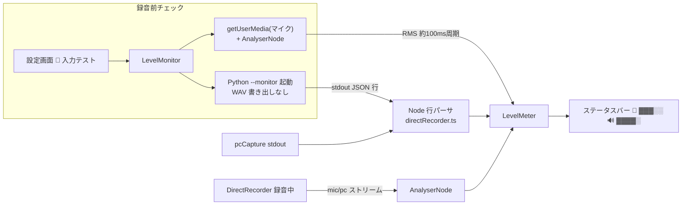

# 入力レベルメーター設計（マイク + PC音声 WASAPI ループバック）

> 📂 パス：docs/superpowers/specs/2026-09-05-input-level-meter-design.md
> 📍 関連：`recorder-bridge/pc_loopback_capture.py` / `obsidian-plugin/src/audio/directRecorder.ts` / `obsidian-plugin/src/ui/recordingTimer.ts`

---

## 1. 背景と目的

録音モード「マイク + PC音声（WASAPI ループバック）」で録音しても、**マイクとスピーカー（PC音声）のどちらかに音が入っていない**ことに録音後に気づく事故がある。

そこで以下を**リアルタイムにアニメーション（レベルメーター）で確認できる**ようにする：

1. 録音マイクデバイスの入力レベル
2. 録音用スピーカーデバイス（ループバック）の入力レベル

### 要件（確定済み）

| 項目 | 決定事項 |
|------|---------|
| 表示場所 | ステータスバー（既存 `🎙️ 00:00` タイマーの左に横並び） |
| 確認タイミング | 録音前チェック **＋** 録音中の常時表示 |
| 録音前チェックの入口 | 設定画面の「🎤 入力テスト」ボタン（コマンド/リボンは作らない） |
| 実装方式 | 案A：PC音声は Python stdout レベルイベント方式 |

## 2. 方式（案A）

| 対象 | 方式 |
|------|------|
| 🎤 マイク | renderer 内の `MediaStream` に `AnalyserNode` を接続し RMS を算出 |
| 🔊 PC音声（WASAPI） | `pc_loopback_capture.py` が 0.1 秒チャンクごとに RMS/peak を計算し stdout に JSON 行で出力。Node 側（stdout を `pipe` に変更）で行パース → UI へ中継 |
| 🔊 PC音声（getDisplayMedia 成功時） | renderer 側ストリームなのでマイクと同じ `AnalyserNode` 方式 |
| 録音前チェック | 同一 Python スクリプトに `--monitor` モード追加（WAV 書き出しスキップ、レベル出力のみ） |

却下した案:

- **案B（マイクのみメーター）**: PC音声の入力確認ができないため要件不適合
- **案C（getDisplayMedia 統一）**: 毎回画面共有ダイアログが出て UX 悪化・既存 WASAPI 経路を放棄するため不採用

## 3. コンポーネント構成

| # | コンポーネント | ファイル | 責務 |
|:-:|------|------|------|
| 1 | Python レベル出力 | `recorder-bridge/pc_loopback_capture.py` | チャンクごとの RMS/peak 計算と stdout 出力。`--monitor` モード |
| 2 | spawn 変更 | `obsidian-plugin/src/audio/directRecorder.ts` | stdout `"ignore"` → `"pipe"`、行パース → `onLevel` コールバック |
| 3 | レベルメーター UI | `obsidian-plugin/src/ui/levelMeter.ts`（新規） | ステータスバーに 🎤/🔊 2 本のバーを描画・アニメーション |
| 4 | 録音前チェック制御 | `obsidian-plugin/src/audio/levelMonitor.ts`（新規） | チェック開始/停止。mic 取得 + Python `--monitor` 起動、両ソースをメーターへ供給 |
| 5 | 設定画面ボタン | `obsidian-plugin/src/settings.ts` | 「🎤 入力テスト開始/停止」トグルボタン |
| 6 | 録音中の供給 | `obsidian-plugin/src/audio/directRecorder.ts` | 保持中ストリームへの AnalyserNode 接続、pcCapture stdout レベルの中継 |

### Python 側インターフェース

- 引数: `pc_loopback_capture.py <出力WAVパス> [スピーカーデバイスID] [--monitor]`
  - `--monitor` 指定時: WAV を書き出さず、レベル出力のみで継続する（`<出力WAVパス>` は必須だが無視される。呼び出し側はダミー値を渡す）
- stdout 出力（0.1 秒ごと・毎回 flush）:

```json
{"type": "level", "rms": 0.05, "peak": 0.12}
```

- RMS/peak は float（-1.0〜1.0 正規化振幅）で、無音時は 0 に近い値
- 既存のエラー出力（`PC_LOOPBACK_ERROR:` → stderr）と終了コード契約は変更しない

### TypeScript 側インターフェース

```ts
// directRecorder.ts（拡張）
export interface PcLoopbackCaptureHandle {
  stop(): Promise<string>;
  /** レベルイベント（stdout JSON 行）を受け取るコールバックを登録 */
  onLevel(cb: (level: { rms: number; peak: number }) => void): void;
}

export interface DirectRecorderDeps {
  // 既存 deps に加え:
  /** マイク/PC（renderer 側ストリーム）のレベル通知先 */
  onStreamLevel?: (source: "mic" | "pc", level: { rms: number; peak: number }) => void;
}
```

- `LevelMeter`（`ui/levelMeter.ts`）:
  - `constructor(el: HTMLElement)` — ステータスバー要素に 2 本のバーを生成
  - `setLevel(source: "mic" | "pc", level: { rms: number; peak: number })`
  - `setUnavailable(source: "pc")` — レベル無応答時の灰色表示
  - `show()` / `hide()`
- `LevelMonitor`（`audio/levelMonitor.ts`）:
  - `start(settings): Promise<boolean>` — mic 取得 + Python `--monitor` 起動 + ステータスバー表示
  - `stop(): void` — ストリーム/プロセス/メーターの解放
  - `isRunning(): boolean`
  - DirectRecorder と同じ DI パターン（deps 注入）でテスト可能にする

## 4. データフロー



### レベル計算・表示仕様

| 項目 | 仕様 |
|------|------|
| RMS 算出（TS側マイク） | `getFloatTimeDomainData` → 二乗平均平方根。約 100ms 周期（`requestAnimationFrame` ではなくタイマーで十分） |
| dB 変換 | `20 * log10(rms)`、下限 -60dB。バー幅 = `(dB + 60) / 60`（0〜1） |
| アニメーション | CSS `width` + `transition: 0.1s linear`。上昇は即時・下降も同一 transition で自然に減衰 |
| 色分け | 緑（-60〜-12dB）→ 黄（-12〜-6dB）→ 赤（-6dB〜）。`cl-` プレフィックスの CSS クラス切替 |
| サイズ | 各バー幅約 60px × 高さ 8px。ラベル 🎤 / 🔊 を左に添付 |

## 5. UI 挙動

- **録音中**: `DirectRecorder.start()` 成功時にメーター表示を開始。`stop()` で非表示。タイマー（`RecordingTimer`）の左に配置
- **録音前チェック**: 設定画面ボタン押下 → ステータスバーにメーター表示 → 再度押下で停止。チェック中はボタン表示が「停止」に切替
- 両者は同一の `LevelMeter` コンポーネントを共用する（同時実行時は録音中を優先し、チェック停止でも録音中メーターは維持）

## 6. エラー処理

| 状況 | 挙動 |
|------|------|
| Python からレベル行が 3 秒間来ない | 🔊 バーを灰色表示（`setUnavailable`）。録音自体は継続 |
| `getUserMedia` 失敗 | Notice 通知。🎤 バーのみ非表示、PC 側は継続 |
| チェック中にデバイス設定を変更 | 自動再起動はしない（停止→再開で反映） |
| 録音停止・チェック停止 | AnalyserNode・stdout パーサ・Python プロセスを既存解放フロー（`releaseSources` / `pcCapture.stop()`）に統合して確実に破棄 |
| stdout パース不能行 | 無視（ログのみ）。既存の診断ログ（`writeDebugLog`）に流す |

## 7. テスト方針（TDD・既存 DI 方針踏襲）

| 層 | テスト |
|------|------|
| Python (pytest) | `--monitor` で WAV を書かないこと。レベル JSON 行（rms/peak を含む）を stdout に出すこと。soundcard はモック。既存 `recorder-bridge/tests/test_bridge.py` / `test_audio_source.py` に追加 |
| TS (vitest) | ① stdout 行パーサ（分割チャンク・複数行・改行なし端数・不正行の無視）② `LevelMeter` の DOM 更新・dB 変換・色クラス切替 ③ `LevelMonitor` の start/stop とリソース解放 ④ `DirectRecorder` のレベル中継（deps DI で拡張） |

## 8. スコープ外

- スペクトラム表示・多帯グラフ（単一バーのみ）
- 録音前チェック中のデバイス変更の自動反映
- モバイル対応（WASAPI は Windows 専用。従来どおり）
- 録音レベルの自動ゲイン調整

## 9. 影響範囲・互換性

- `pc_loopback_capture.py` は引数追加のみで既存呼び出し（`<outPath> [speakerId]`）は互換維持
- `PcLoopbackCaptureHandle` にメソッド追加するが、既存 `stop()` 契約は不変
- デプロイ: Python スクリプトは `settings.pcLoopbackScriptDir`（Vault 内配置）経由で参照されるため、Vault への再配置が必要（既存デプロイ手順に従う）
